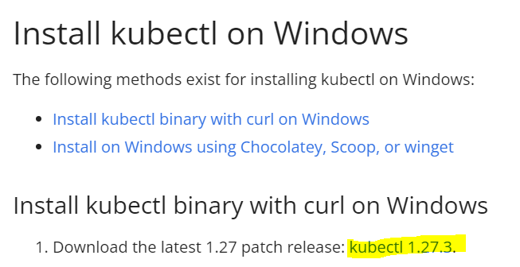
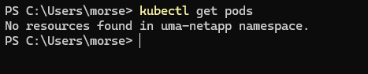

# Steps to deploy Network App on Malaga Kubernetes using Windows 10

1. [Push the NetApp image to the docker hub](https://www.youtube.com/watch?v=EIHY_CY5J0k&ab_channel=DailyCodeBuffer)

**The NetApp .sh file has to have the environment as development**

evolved5g register-and-onboard-to-capif --config_file_full_path="/usr/src/app/capif_registration.json" --environment="development"

`docker compose build`

Search the NetApp image

`docker images`

`docker tag nameImage:tag nameUserDockerHub/nameImage:version`

`docker login`

`docker push nameUserDockerHub/nameImage:version`

2. Activate VPN profile using [OpenVPN client](https://openvpn.net/client/client-connect-vpn-for-windows/)

3. Download and install [kubectl](https://kubernetes.io/docs/tasks/tools/install-kubectl-windows/)

4. Enter the following commands in a terminal in the order shown below:

`kubectl config set-cluster <CLUSTER_NAME> --server=https://10.173.0.117:8383 --insecure-skip-tls-verify=true`

`kubectl config set-credentials <USER_NAME> --token=<TOKEN>`

`kubectl config set-context <CONTEXT_NAME> --cluster=<CLUSTER_NAME> --user=<USER_NAME> --namespace <NAMESPACE>`

`kubectl config use-context <CONTEXT_NAME>`

You can put whatever values you want in CLUSTER_NAME and CONTEXT_NAME

USER_NAME, NAMESPACE and TOKEN are needed from UMA

5. To check that you are inside the namespace run:

`kubectl get pods`

If it does not return an error, it means that it is well connected

If there is an error, it means that some of the above steps are wrongly done. Check it carefully

6. Add the endpoints in the /etc/hosts file of the NEF and CAPIF

To do this step it is necessary to run Notepad++ with administrator permissions. Once started, open the file located in the path:

`C:\Windows\System32\drivers\etc\hosts`

Add the endpoints provided by Telefonica and save the file

7. Create environment.yaml, deployment.yaml and service.yaml files using Immersion's NetApp as a guide

8. Once the files have been created, they must be applied:

`kubectl apply -f environment.yaml`

`kubectl apply -f deployment.yaml`

`kubectl apply -f service.yaml`

9. To view the deployment information:

`kubectl get all`

10. If everything goes well, after a short period of time (about one minute) everything will be in a running state. If there is a problem, it will not be running

If it is not running you can access the pod logs and see what is going wrong:

`kubectl log namePod`

`kubectl describe pod namePod`

`kubectl describe service nameService`

**Every time it does not work and the NetApp has been linked to the CAPIF, you have to change the necessary values of the capif_registration.json file and push the image back to docker hub as said in step 1**

If it is running the service type will be LoadBalancer and you will get an external IP address and port. You can access that IP address and port through a browser

It may be that the NetApp is not working when you log in either, you can use the command above and see what happened

`kubectl log namePod` 